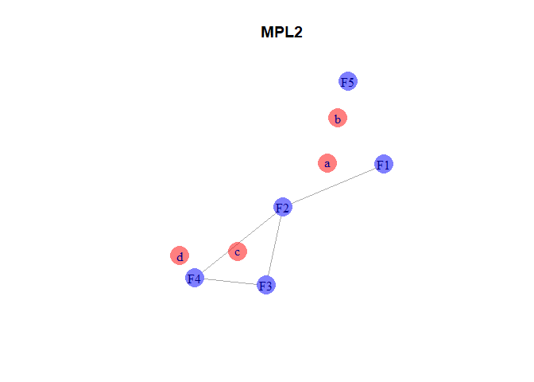
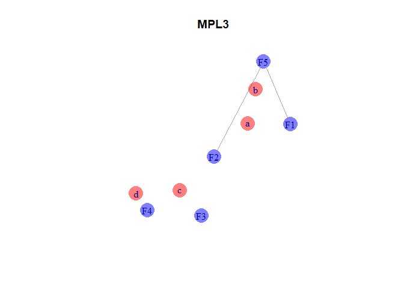

Collapse Multilevel Network
================
JC
20/02/2021

\[\\[1cm]\]

# Globals

``` r
#-----------------------------------
# load libraries
library(igraph)
library(scales)
library(reshape2)
#-----------------------------------
# globals
# function to plot
plotNet <- function(g, ecolor = "black", mycoords = coords, title = ""){
  plot(g, 
       layout=mycoords,
       vertex.color = get.vertex.attribute(graph = g, name = "color"),
       # vertex.frame.color= get.vertex.attribute(graph = g, name = "color"),
       vertex.size = 19,
       vertex.frame.color = "transparent",
       main = title
       # ,vertex.label=NA
       )
}

# ac.dist to edge list format:
gen.mat.to.edge.list<-function(mat,symmetric=TRUE,diagonal=FALSE,text=FALSE){
  #create edge list from matrix
  # if symmetric duplicates are removed
  mat<-as.matrix(mat)
  id<-is.na(mat) # used to allow missing
  mat[id]<-"nna"
  if(symmetric){mat[lower.tri(mat)]<-"na"} # use to allow missing values
  if(!diagonal){diag(mat)<-"na"}
  obj<-melt(mat)
  colnames(obj)<-c("from","to","value")
  obj<-obj[!obj$value=="na",]
  obj$value[obj$value=="nna"]<-NA
  if(!text){obj$value<-as.numeric(as.character(obj$value))}
  return(obj)
  # remove duplicates
}
```

## Create a multilevel network

``` r
# create network
#vertices:
v.df <- data.frame(id = c("F1","F2","F3","F4","F5","a","b","c", "d"),
                   type = c(rep("facility", times = 5),
                            rep("staff", times = 4)))
v.df$color <- ifelse(v.df$type == "facility", alpha("blue",.5), alpha("red",.5))

#edges
e.df <- data.frame(source = c("F1","F2","F2","F3","F4","F4","F5","a","c"),
                    target = c("a","a","c","c","c","d","b","b","d"))

# create igraph object
g <- graph.data.frame(d = e.df, directed = FALSE, v = v.df)

# define layout for raw data
coords.r <- layout.fruchterman.reingold(g)

plotNet(g, mycoords = coords.r, title = "raw net")
```

<!-- -->

## Collapse at facility-level using minimum path-lenth 2

``` r
# calculate the shortest distance between all aged cre nodes:
ac.dist <- igraph::distances(g, v = V(g)$type == "facility", 
                               to = V(g)$type == "facility",
                     mode = "all")

# from matrix to edge list
pl.edg <- gen.mat.to.edge.list(ac.dist, symmetric = TRUE,
                                 diagonal = FALSE, text = FALSE)
# subset mpl2
mpl2.edf <- subset(pl.edg, value == 2)

# create network object
g.mpl2 <- graph.data.frame(d = mpl2.edf,
                           directed = FALSE,
                           v = v.df)
plotNet(g.mpl2, mycoords = coords.r, title = "MPL2")
```

<!-- -->

## Collapse at facility-level using minimum path-lenth 3

``` r
# subset mpl3
mpl3.edf <- subset(pl.edg, value == 3)

# create network object
g.mpl3 <- graph.data.frame(d = mpl3.edf,
                           directed = FALSE,
                           v = v.df)
plotNet(g.mpl3, mycoords = coords.r, title = "MPL3")
```

<!-- -->

## Collapse at facility-level using path-lenth 3
